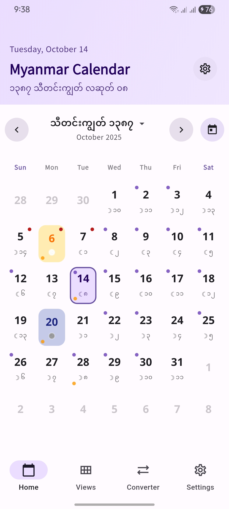
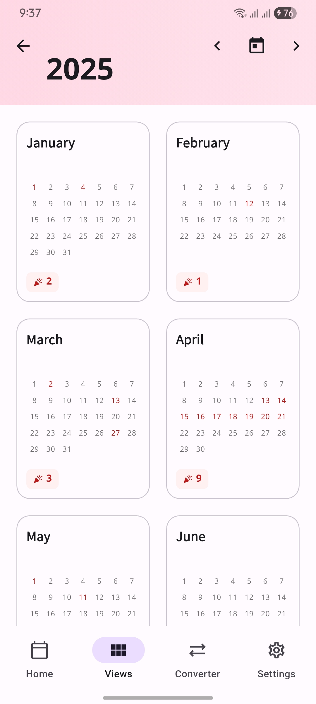
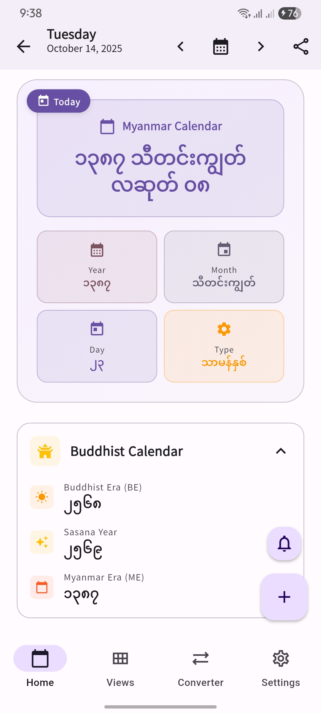
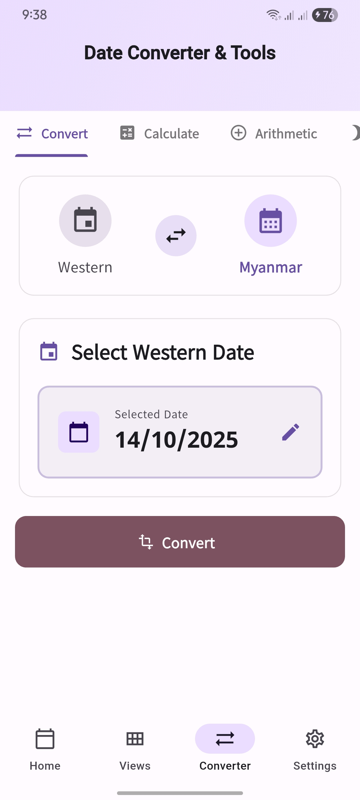
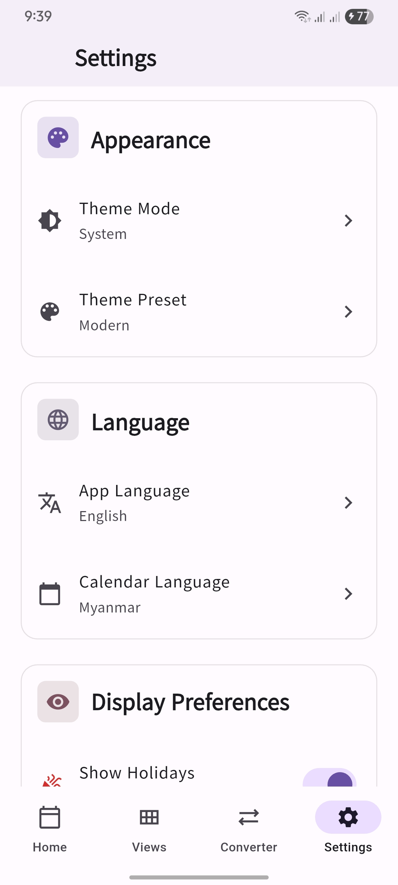

# 🗓️ Myanmar Calendar App

<div align="center">


**A comprehensive Myanmar Calendar application with astrological information, date conversion, and beautiful UI**

[](https://flutter.dev/)
[](LICENSE)
[](https://flutter.dev/)

[Features](#-features) • [Screenshots](#-screenshots) • [Installation](#-installation) • [Architecture](#-architecture) • [Contributing](#-contributing)

</div>

---

## 📱 About

Myanmar Calendar App is a modern, feature-rich calendar application that seamlessly integrates Myanmar (Burmese) calendar with the Gregorian calendar. It provides comprehensive astrological information, holiday tracking, and date conversion utilities - all wrapped in a beautiful, intuitive interface.

Perfect for:

- 🇲🇲 Myanmar users who need traditional calendar information
- 📅 Anyone interested in Myanmar culture and astrology
- 🌏 Travelers and expatriates in Myanmar
- 📚 Researchers studying Myanmar calendar systems

---

## ✨ Features

### 🗓️ Calendar Views

- **Month View**: Full month calendar with Myanmar and Western dates
- **Year View**: Overview of all 12 months with quick navigation
- **Week View**: Detailed 7-day view with comprehensive information
- **Day View**: In-depth information for any selected date

### 🌙 Myanmar Calendar Information

- Complete Myanmar date display (Year, Month, Day)
- Buddhist Era (BE) and Sasana Year
- Moon phases and fortnight days
- Watat (intercalary) year information
- Myanmar weekday system

### ⭐ Astrological Information

- Sabbath days (ဉပုသ်)
- Yatyaza (ရက်ရာဇာ) information
- Pyathada (ပြဿဒါး) calculations
- Nagahle (နဂါးခေါင်း) direction
- Mahabote (မဟာဘုတ်) values
- Nakhat (နက္ခတ်) information
- Year names from 12-year cycle
- Special astrological days

### 🎉 Holidays & Special Days

- Myanmar public holidays
- Religious holidays
- Cultural celebrations
- Customizable holiday display

### 🔄 Date Converter

- Western ↔ Myanmar date conversion
- Date difference calculator
- Date arithmetic (add/subtract days, months)
- Moon phase finder
- Julian Day Number support

### 🎨 Customization

- Light and Dark themes
- Multiple theme presets (Modern, Traditional, Ocean, Forest)
- Custom color picker for personalized themes
- Multi-language support (Myanmar, English, Zawgyi, Mon, Shan, Karen)
- Adjustable text sizes
- Customizable calendar settings

### ⚙️ Advanced Features

- Offline functionality (no internet required)
- Fast and responsive performance
- Clean, modern Material Design 3 UI
- Smooth animations and transitions
- Haptic feedback
- Share date information

---

## 📸 Screenshots

<div align="center">

| Month View | Year View | Day Details |
|------------|-----------|-------------|
|  |  |  |

| Date Converter | Settings | Theme Presets |
|----------------|----------|---------------------|
|  |  |  |

</div>

---

## 🚀 Installation

### Prerequisites

- Flutter SDK (3.0 or higher)
- Dart SDK (3.0 or higher)
- Android Studio / VS Code with Flutter extensions
- iOS: Xcode 14+ (for iOS development)
- Android: SDK 21+ (Android 5.0 Lollipop)

### Clone the Repository

```bash
# Clone the repository
git clone https://github.com/mixin27/mmcalendar.git myanmar_calendar_app

# Navigate to the project directory
cd myanmar_calendar_app

# Get dependencies
flutter pub get

# Run the app
flutter run
```

### Build for Production

```bash
# Build Android APK
flutter build apk --release

# Build Android App Bundle (for Play Store)
flutter build appbundle --release

# Build iOS (requires Mac)
flutter build ios --release
```

### Firebase Remote Config

**Key:** - `holidays_config`

**Value:** - JSON string

Sample
```json
{
    "customHolidays": [
        {
            "id": "my_anniversary",
            "name": "My Anniversary",
            "type": "otherAnniversary",
            "rule": {
                "type": "western",
                "month": 12,
                "day": 25
            }
        },
        {
            "id": "my_anniversary_2",
            "name": "My Anniversary 2",
            "type": "otherAnniversary",
            "rule": {
                "type": "myanmar",
                "month": 4,
                "day": 13
            }
        }
    ],
    "disabledHolidays": ["aprilFoolsDay", "halloween"],
    "disabledHolidaysByYear": {
        "2027": [
            "valentinesDay"
        ]
    }
}
```

Please see [Holiday IDs](https://github.com/mixin27/myanmar_calendar_dart/blob/main/lib/src/models/holiday_id.dart)

---

## 🏗️ Architecture

The app follows **Clean Architecture** principles with a modular, feature-based structure:

```
myanmar_calendar_app/
├── packages/
│   ├── shared/            # Shared facades (core, ui_kit, localizations)
│   ├── integrations/      # Platform/service adapters (firebase, database, telegram_web)
│   └── features/
│       ├── calendar/      # Calendar feature module
│       ├── views/         # Year/Week/Day views
│       ├── converter/     # Date conversion tools
│       ├── settings/      # App settings
│       └── events/        # Events
└── apps/
    └── myanmar_calendar/  # Main application
```

### Technology Stack

- **Framework**: Flutter 3.x
- **State Management**: flutter_bloc
- **Navigation**: go_router
- **Database**: drift (SQLite)
- **Dependency Injection**: get_it + injectable
- **Calendar Engine**: flutter_mmcalendar (custom package)

### Key Patterns

- ✅ Clean Architecture (Domain, Data, Presentation)
- ✅ BLoC Pattern for state management
- ✅ Repository Pattern for data access
- ✅ Explicit feature orchestration (no global event bus)
- ✅ Modular, feature-based structure
- ✅ Dependency-boundary guardrails (`dart run tool/check_dependency_boundaries.dart`)

---

## 🤝 Contributing

We welcome contributions! Please see our [Contributing Guidelines](CONTRIBUTING.md) for details.

### How to Contribute

1. Fork the repository
2. Create your feature branch (`git checkout -b feature/AmazingFeature`)
3. Commit your changes (`git commit -m 'Add some AmazingFeature'`)
4. Push to the branch (`git push origin feature/AmazingFeature`)
5. Open a Pull Request

### Development Setup

```bash
# Install dependencies
flutter pub get

# Run code generation
flutter pub run build_runner build --delete-conflicting-outputs

# Run the app in debug mode
flutter run
```

---

## 📝 License

This project is licensed under the MIT License - see the [LICENSE](LICENSE) file for details.

---

## 🙏 Acknowledgments

- Myanmar Calendar calculations based on [Yan Naing Aye's algorithm](http://cool-emerald.blogspot.com/2013/06/algorithm-program-and-calculation-of.html)
- Astrological calculations from traditional Myanmar calendar systems
- Icons from Material Design Icons
- Community feedback and contributions

---

## 📞 Support

- 📧 Email: [kyawzayartun.contact@gmail.com](kyawzayartun.contact@gmail.com)
- 🐛 Issues: [GitHub Issues](https://github.com/mixin27/mmcalendar/issues)
<!-- - 💬 Discussions: [GitHub Discussions](https://github.com/mixin27/mmcalendar/discussions) -->
<!-- - 📱 Facebook: [Your Facebook Page](https://facebook.com/yourpage) -->

---

## 🌟 Star History

[](https://star-history.com/#mixin27/mmcalendar&Date)

---

<div align="center">

**Made with ❤️ for the Myanmar community**

[⬆ Back to Top](#-myanmar-calendar-app)

</div>
